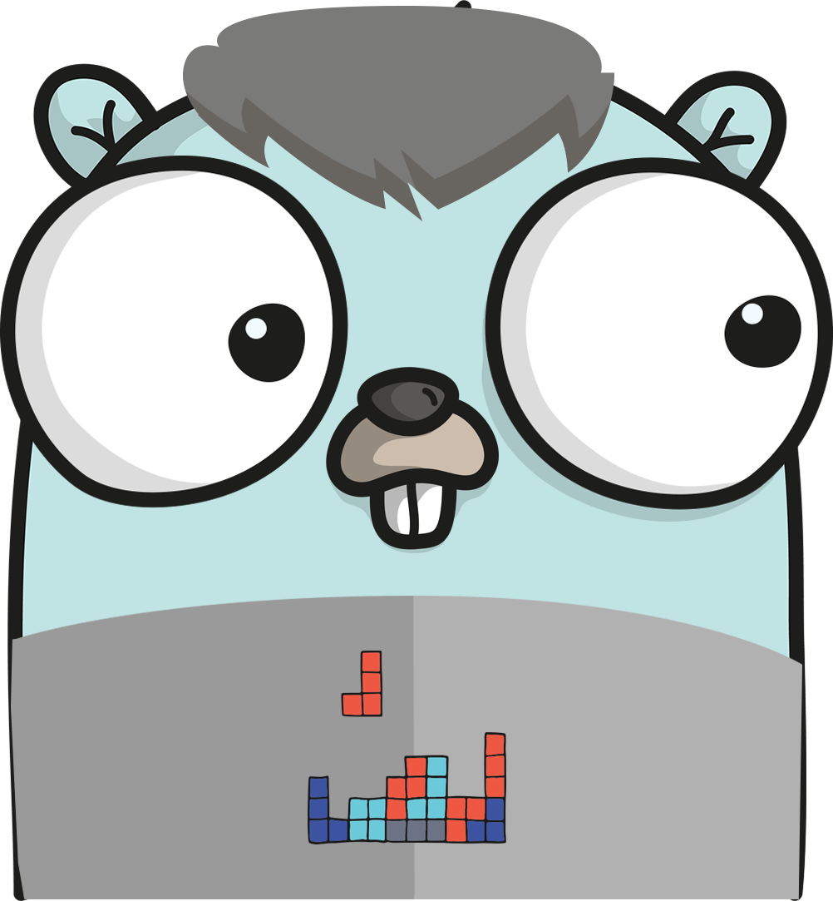

<p align="center">
    
</p>

# kk - Golang boilerplate CLI tool
> [!TIP]
> Create, setup and extend a Golang project like a puzzle in seconds

## How to use it?
### Install

```zsh
go install github.com/waler4ik/kk@latest
```
After installation use `kk` command in your shell.

### Init command
Creates a Golang REST server project without endpoints.

```zsh
kk init 
```

### Add command
Creates and wires a REST resource endpoint
```zsh
kk add resource machines/data
```
After adding a resource implement the endpoint business logic in `internal/endpoints/machines/data/provider.go` and `internal/endpoints/machines/data/model.go`.
Paths may be different depending on the path given in the command arguments above.

Creates and wires a websocket endpoint. It's based on Melody project (https://github.com/olahol/melody).
```zsh
kk add ws rest/ws
```

## OpenAPI / Swagger interface
REST resource endpoints added with `kk add` come along with [swaggo/swag](https://github.com/swaggo/swag) annotations. So you can tell the world how your REST webservice works.

Possible workflow:
- Generate swagger 2.0 specification with [swaggo/swag](https://github.com/swaggo/swag). Run `swag init -g internal/docs/docs.go`.
- Generate a Golang client from previously generated swagger 2.0 specification with [go-swagger](https://github.com/go-swagger/go-swagger) and use it for your Golang client application or just test your previously generated webservice.

## Example project
kk generates projects like this https://github.com/waler4ik/kk-example (chi router, REST endpoints).

## Testing locally
After running `kk init`, build and start your service with the commands below. Then check your endpoints using a tool of your choice.
```zsh
docker compose build && docker compose up -d
```
## Upcoming features (commands)
- [x] Add websocket command
- [x] Generate swagger/openapi specification command
- [ ] Select router within init command (chi, gin, gorilla)
- [ ] Add kubernetes scripts command
- [ ] Add github scripts command

## Similar approaches 
- https://github.com/hay-kot/scaffold It's a more general approach. It gives you the possibility to write and use your own templates.
